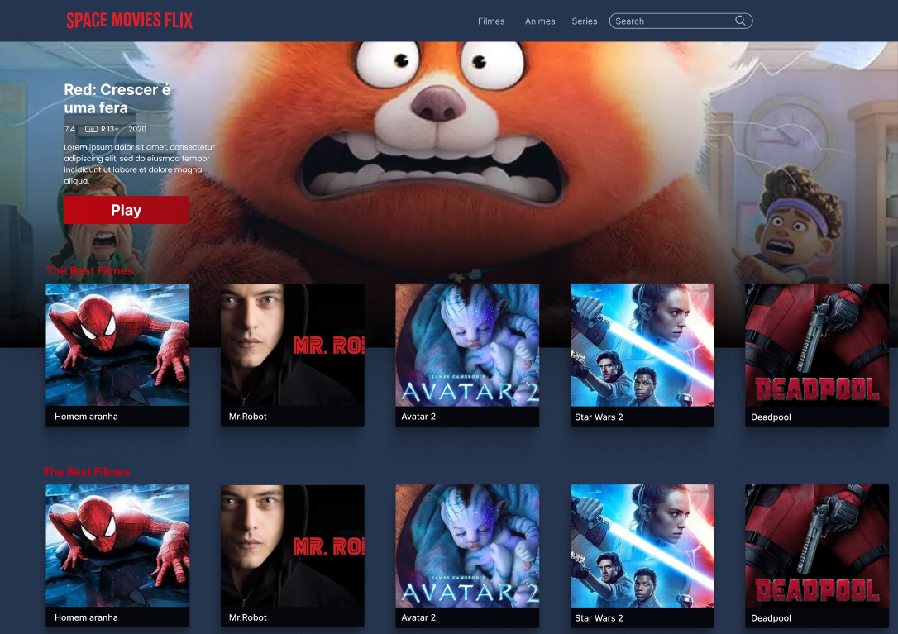

# Space Movies Flix



Aplicação desenvolvida para aplicar os conhecimentos básicos de desenvolvimento web.

## Conceitos aplicados

...

## Tecnologias utilizadas 📝

- [SASS](https://sass-lang.com/)
- [SlickJS](https://kenwheeler.github.io/slick/)
- JAVASCRIPT
- [Json Server](https://www.npmjs.com/package/json-server)

## Como executar o projeto

### Clonando repositório

```shell
$ git clone https://github.com/GuuiiCode/SpaceMoviesFlix
$ cd SpaceMoviesFlix
$ yarn // Use npm install se estiver usando npm
```

### Rodando projeto

```
$ yarn sass // Use 'npm run sass' se estiver usando npm
$ yarn server // Use 'npm run server' se estiver usando npm
```

## Contribuições

<table>
    <tr>
        <td align="center">
            <a href="https://kentcdodds.com">
                <br /><sub><b>Jonathan Matos</br>(pequenojoohn)</b></sub></a><br />
                <a href="https://jonathan-matos.netlify.app/" title="github">🌐</a>
        </td>
    </tr>
</table>
